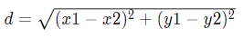

# Расстояние между точками

Напишите программу, которая рассчитает евклидово расстояние между точками на плоскости `(x1, y1)` и `(x2, y2)`:



### Передача данных на вход

Передать данные на вход можно через `echo` и пайп. Например, если исходный файл называется `distance.go`:

```bash
$ echo "1 1 4 5" | go run distance.go
5
```

[<< Назад](../consts.md)