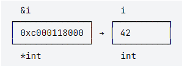
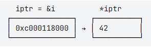
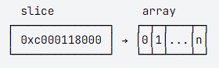

# Указатели

*Указатель* (pointer) содержит адрес памяти, который ссылается на конкретное значение.

Тип `*T` — указатель на значение типа `T`. Если указатель не инициализирован, он равен `nil` (аналог `None` в питоне и `null` в js).

```go 
// iptr - указатель на значение типа int
// пока что он пустой
var iptr *int
fmt.Println(iptr)
// <nil>
```

Оператор `&` возвращает указатель на конкретное значение:

```go 
i := 42
iptr = &i

// теперь iptr ссылается на i
fmt.Println(iptr)
// 0xc000118000
```

`0xc000118000` — адрес памяти. По этому адресу находится значение `42`.

Оператор `*` обращается к значению, на которое ссылается указатель. Оно доступно как для чтения, так и для записи:

```go 
// прочитать значение i через указатель iptr
fmt.Println(*iptr)
// 42

// установить значение i через указатель iptr
*iptr = 21
fmt.Println(i)
// 21
```

Вот схема непростых отношений между значением и указателем на него:



`&i` — указатель на `i`. Его тип — `*int`, а значение — `0xc00011800`. По адресу `0xc000118000` находится значение `i` — 42.



`iptr` — указатель на `i`. Вызывая `*iptr`, мы обращаемся по адресу `0xc000118000` и получаем значение `i` — 42.

# Указатели в параметрах функции

Указатели в параметрах функции позволяют изменять переданные значения. Вот как это работает.

Функция `addval()` принимает параметр типа `int` — конкретное число. При вызове Go передает не оригинальное число `n`, а его копию — `nval`:

```go 
func addval(nval int, delta int) {
    nval += delta
}

n := 42
addval(n, 3)
fmt.Println(n)
// 42
```

`addval()` модифицировала копию оригинального числа `nval`, так что само `n` не изменилось.

Функция `addptr()` принимает параметр типа `*int` — указатель на число. При вызове Go передает адрес в памяти, по которому находится оригинальное число `n` — указатель `nptr`. Функция изменяет значение n по указателю через оператор `*`:

```go 
func addptr(nptr *int, delta int) {
    *nptr += delta
}

n := 42
addptr(&n, 3)
fmt.Println(n)
// 45
```

Благодаря оператору `&`, в функцию передано не значение n, а указатель на него. `addptr()` изменила оригинальное значение `n` через переданный указатель.

# Указатель или значение?

Базовый принцип такой:

* Если функция только читает переменную, но не изменяет — передавайте значение.
* Если функция изменяет значение — передавайте указатель.

Функция `math.Max()` возвращает максимальное из двух чисел:

```go 
a := 5
b := 3
max := math.Max(a, b)
```

`a` и `b` не изменяются, поэтому функция принимает обычные значения.

Функция `fmt.Scanf()` считывает значения из стандартного ввода и записывает их в переданные переменные. Поэтому принимает указатели:

```go 
var a, b int
fmt.Scanf("%d-%d", &a, &b)
```

Правило работает для скалярных значений (логических, чисел, строк) и массивов. Со срезами и картами другая история.

# Указатель или значение? Срезы и карты

Функция стандартной библиотеки `sort.Ints()` сортирует срез:

```go 
func Ints(nums []int)
```

Обратите внимание — функция ничего не возвращает, она изменяет элементы оригинального среза. Но почему тогда `nums` передан как значение (`[]int`), а не как указатель (`*[]int`)?

Дело в том, что срез сам по себе не содержит данные массива. Срез — это легковесная структура данных, одно из полей которой — указатель на конкретный массив. Поэтому `nums` внутри функции — это копия, но не всего массива, а этой легковесной структуры с указателем на массив. Обращаясь к элементу среза, функция переходит по указателю и модифицирует оригинальный элемент массива.



Если функция изменяет отдельные элементы среза, передавайте его как значение:

```go 
func sortSlice(nums []int) {
    sort.Ints(nums)
}

nums := []int{5, 1, 3, 9}
sortSlice(nums)
fmt.Println(nums)
// [1 3 5 9]
```

Этот подход не сработает, если изменить сам срез (добавить или удалить элементы):

```go 
func appendByVal(nums []int, n int) {
    nums = append(nums, n)
}

nums := []int{42}
appendByVal(nums, 43)
fmt.Println(nums)
// ожидание: [42 43]
// реальность: [42] 
```

`nums` внутри функции — это копия оригинального среза. Изменив `nums` через `append()`, функция поменяла копию, а оригинал не изменился.

Чтобы изменить срез в целом, можно использовать указатель:

```go 
func appendByPtr(nums *[]int, n int) {
    *nums = append(*nums, n)
}

nums := []int{42}
appendByPtr(&nums, 43)
fmt.Println(nums)
// [42 43]
```

Но в обычных функциях такой подход нечасто встретишь. Лучше вернуть новый срез, чем переопределять старый по указателю:

```go 
func appendAndReturn(nums []int, n int) []int {
    nums = append(nums, n)
    return nums
}

nums := []int{42}
nums = appendAndReturn(nums, 43)
fmt.Println(nums)
// [42 43]
```

Итого:

* если функция не меняет срез — передавать значение;
* если функция меняет отдельные элементы, но не сам срез — передавать значение;
* если функция меняет сам срез — передавать значение и возвращать новое значение.

Вариант «передавать указатель на срез» остается для методов, о которых мы поговорим на следующем уроке.

Для карт принцип такой же.

[Задание 2. Перетасовка](tasks/task2.md)

[<< Назад](funcs.md) [На главную](content.md)